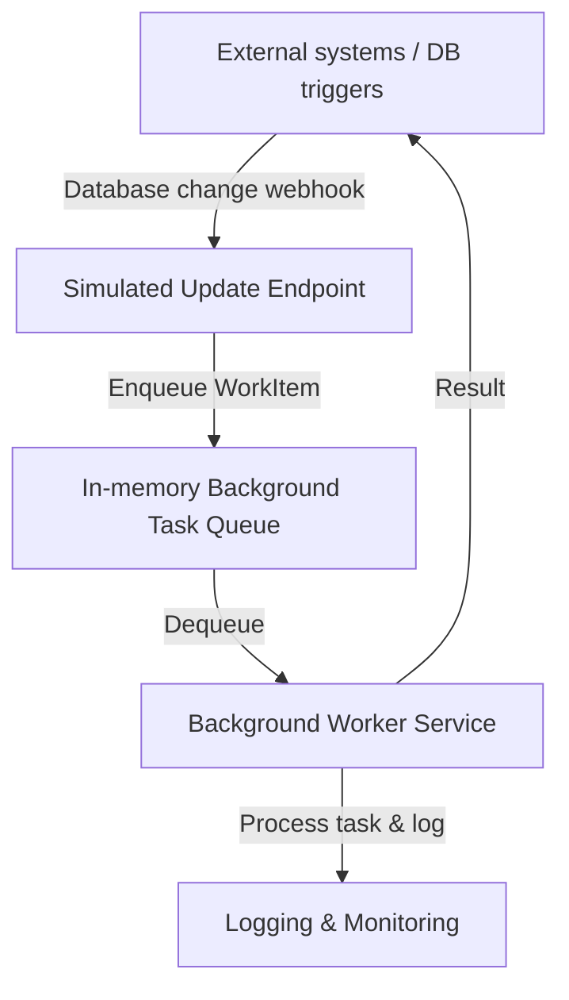

# Background Task Queue Processing App - Design Document

## 1. Project Type Selection

The solution uses an **ASP.NET Core Web API (minimal API)** project. This template offers:

- **Broad hosting support** – the same project can run in Kestrel self-hosting, behind IIS, or in Azure App Service without changes.
- **Lightweight footprint** – minimal APIs start quickly and reduce cold-start overhead compared to MVC-heavy templates.
- **Integrated background processing** – the ASP.NET Core hosting model natively supports `IHostedService` and dependency injection, making it simple to run queue workers alongside HTTP endpoints.

## 2. Architecture Overview

- **Queue Producer** – In production this would be a notification from the database change-tracking mechanism. The prototype simulates this with an HTTP endpoint (`POST /simulate-update`).
- **Queue** – An in-memory bounded channel implementing `IBackgroundTaskQueue`. It provides back-pressure to avoid unbounded memory consumption.
- **Consumer** – `TaskProcessingService` (`BackgroundService`) that continuously dequeues and processes work items.
- **Hosting** – The same app can be run via the `dotnet` CLI (Kestrel), IIS (ASP.NET Core Module), or Azure App Service.

## 3. IIS and Azure Configuration to Avoid Shutdowns

### IIS
- Enable **Always On** in the application pool to prevent idle shutdown.
- Disable or extend the **Idle Time-out** setting (set to `0` for no timeout or a sufficiently high value).
- Use the **Start Mode = AlwaysRunning** option (requires IIS 8.0+) to keep the worker process alive.
- Configure the ASP.NET Core Module with `hostingModel="InProcess"` for faster startup or `OutOfProcess` when self-contained.

### Azure App Service
- Enable **Always On** in the App Service settings to keep the site warm.
- Consider **preloading** the site with the `WEBSITE_ADD_SITENAME_TO_APPHOST_CONFIG=1` and `WEBSITE_DYNAMIC_CACHE=1` environment settings for responsiveness.
- Use the **Application Initialization** feature to trigger a warm-up ping (e.g., call `/health`).
- For slot swaps, configure the warm-up endpoint in `applicationHost.xdt` to ensure the background worker is alive before swap.

## 4. Cost Minimization Strategy in Azure
- Use an **App Service Plan** in the **Basic** tier or **Premium v2/v3** with the smallest instance size that meets CPU/memory requirements. Combine with auto-scale rules based on CPU/queue length metrics.
- Leverage **Azure Functions** or **WebJobs** for bursty workloads if the queue can be externalized (e.g., Storage Queue) while keeping the API on the smaller App Service instance.
- Monitor queue length and worker throughput to adjust scaling dynamically, avoiding over-provisioning.
- Use **Application Insights sampling** and logging levels tuned to reduce storage and telemetry costs.
- For development/test, use the **Free** or **Shared** tiers, accepting their idle timeout, while production stays on a paid tier with Always On.

## 5. Prototype Behavior Summary
- `POST /simulate-update` simulates a database-triggered update and enqueues a work item.
- `TaskProcessingService` continuously dequeues and processes tasks with simulated work.
- `GET /tasks` returns recently processed items (last 5 minutes) for visibility.
- `GET /health` provides a lightweight readiness probe for load balancers or Azure health checks.
